<p align="center">
  
</p>

A focus timer for the Spotify Car Thing, with a shelf of swappable visual
designs. Turn the wheel to set the time, press to start, hold to stop. Sessions
are logged on the device so you can see today's focus, your streak, and the week
behind you.

The Car Thing runs it as a [bridgething](#bridgething) webapp: a small React app
served off the device, driven by its rotary encoder and buttons on an 800x480
screen.

## Designs

Twelve designs, switchable at any time from the design picker. They share one
timer and one history; only the presentation changes.

| | | |
| :---: | :---: | :---: |
| 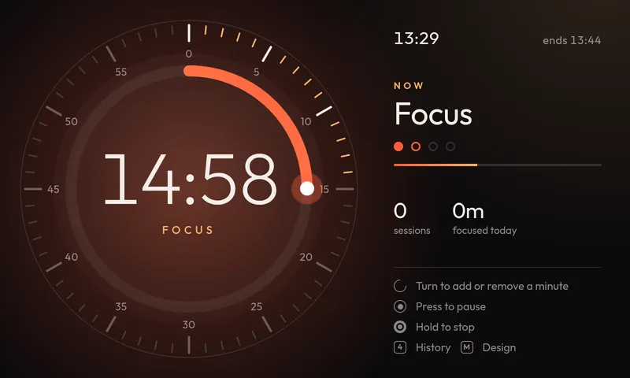<br>**Ember**<br>Warm glow, Time Timer dial (default) | 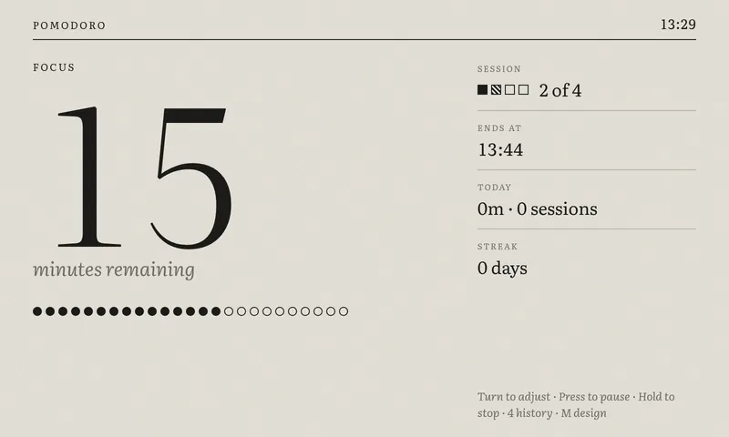<br>**E-ink**<br>Calm paper, minute by minute | 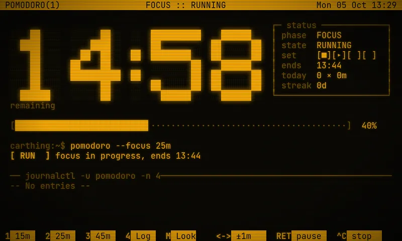<br>**Terminal**<br>80x24 phosphor, block digits |
| 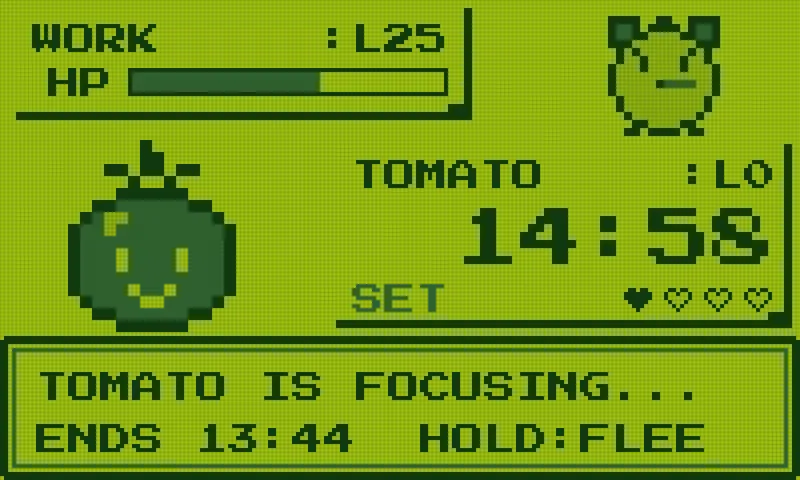<br>**Game Boy**<br>Pixel battle against WORK | 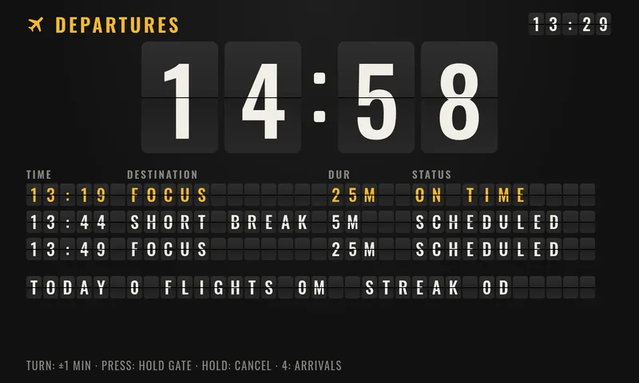<br>**Split-flap**<br>Departures board, flipping digits | 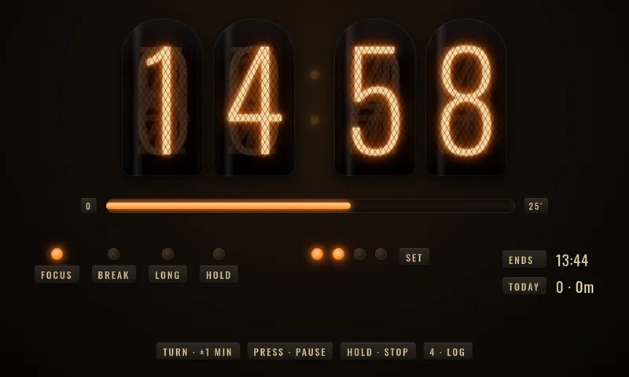<br>**Nixie**<br>Glowing tubes, neon lamps |
| 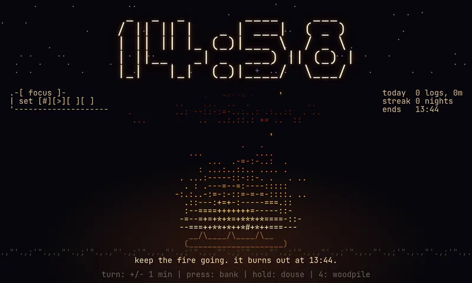<br>**ASCII campfire**<br>Text-art fire that burns down | 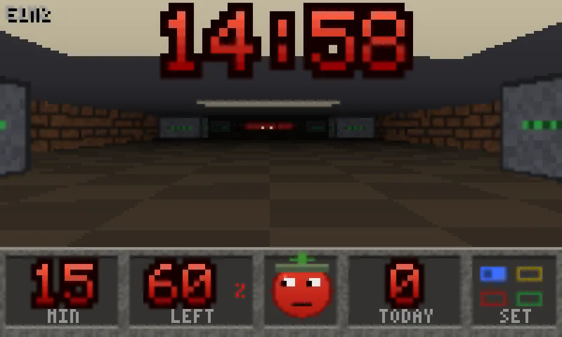<br>**Doom**<br>Walk the corridor to the exit | <br>**Backrooms**<br>Found footage, focus in Level 0 |
| 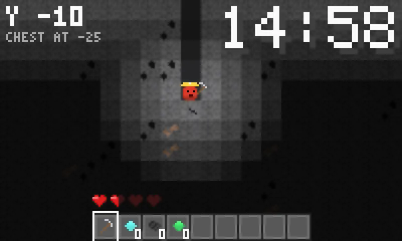<br>**Mineshaft**<br>Dig one block per minute | 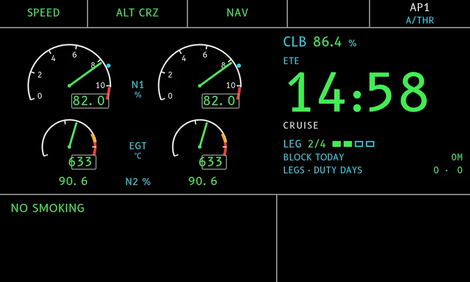<br>**Cockpit**<br>Jetliner engine display, fly each focus as a leg | 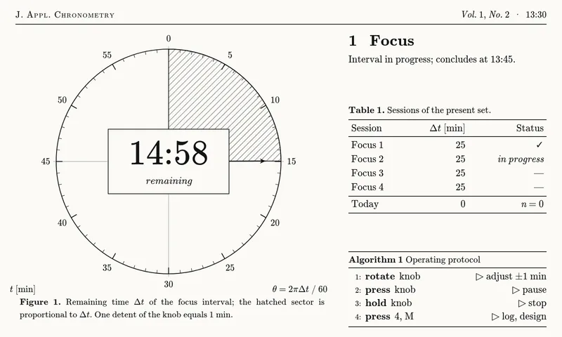<br>**Journal**<br>Computer Modern and TikZ |

## Controls

The Car Thing has a rotary encoder (the wheel), a press-in knob, four buttons
along the top, a mic button, and a back button.

| Input | Timer | Design picker | History |
| --- | --- | --- | --- |
| Turn wheel | Idle: set the duration. Running: add or remove whole minutes | Move through designs (live preview behind the picker) | Scroll days, clockwise toward today |
| Press knob | Start, pause, or resume | Apply the highlighted design | Back to the timer |
| Hold knob (0.7 s) | Stop the active phase, or skip a waiting break | — | — |
| Button 1 / 2 / 3 | Preset 15 / 25 / 45 min | — | — |
| Button 4 | Toggle history | — | Toggle history |
| Mic button | Open the design picker | Close | — |
| Back button | — | Close | Close |

## How the timer works

A classic Pomodoro set is four focus sessions. After each focus session comes a
short break; after the fourth, a long break, then the set starts over.

- Defaults: 25 min focus, 5 min short break, 15 min long break.
- Ranges: focus 1-90, short break 1-30, long break 5-60 minutes.
- Focus flows straight into its break. A finished break waits idle, so the next
  focus starts on purpose.
- Breaks chain from the instant the previous phase ended, not from when the tick
  noticed, so a 5-minute break is exactly five minutes and never shows 05:01.
- Holding during a long break (stop or skip) ends the set and resets the count.

### History

Every finished focus session, and any stopped one longer than a minute, is kept
on the device (up to about a year of sessions). The history view shows a week at
a time with daily focus totals, the busiest day, and the current streak of
consecutive days with a finished session.

### The clock

The Car Thing has no battery-backed real-time clock. A systemd guard saves the
time every few minutes and restores it at boot, so after a power-off the clock
resumes behind by however long the device was off. The app judges whether the
clock is believable, strongest evidence first:

1. the paired phone's wall clock, when the gateway supplies one;
2. a logged session that ends in the "future" (the clock went backwards);
3. the boot id (a clock confirmed on a boot stays trusted until the next boot).

Designs surface this as an unobtrusive warning rather than silently logging
sessions against a wrong time.

## Architecture

Timer logic and presentation are kept apart.

- `timer.ts` is the pure state machine: `press`, `turn`, `hold`, `complete`, and
  history encoding. No React, no device calls.
- `model.ts` derives a `TimerView` / `HistoryView` from that state: everything a
  design needs to draw, already computed (countdown string, progress, schedule,
  streak, today's totals).
- Each design under `src/themes/<id>/` renders only that view model, plus a
  matching history screen. Adding a design is a folder and one entry in
  `src/themes/index.ts`; it never touches timer logic.
- `App.tsx` wires device input (wheel, knob, buttons) to the state machine,
  runs the tick, and handles persistence.

### Storage

State is persisted through the bridgething daemon's per-app store, with
`localStorage` as a fallback for the moment before the socket settles and for
desktop development where there is no daemon. Keys:

- `pomodoro.v1` — timer state (debounced writes)
- `pomodoro.history.v1` — session history, in a compact array form
- `pomodoro.theme.v1` — selected design
- `pomodoro.clock-trust.v1` — the boot id on which the clock was last confirmed

Completion chimes use whichever device earcon looks like a notification sound.

## bridgething

[bridgething](https://github.com/JoeyEamigh/bridgething) is a community platform
that turns the discontinued Spotify Car Thing into a programmable device. A
daemon runs on the device, serves small web apps, and exposes a typed client SDK
([`@bridgething/client`](https://www.npmjs.com/package/@bridgething/client), MIT)
that a webapp uses to talk to the hardware over a local WebSocket. More at
[bridgething.com](https://bridgething.com).

This project is one such webapp. It ships a `public/manifest.json` (app id, name,
icon, permissions) and uses these SDK surfaces:

- **store** — per-app key/value persistence (timer state, history, chosen design,
  the clock-trust marker)
- **time** — the paired phone's wall clock, to sanity-check the device's
  RTC-less clock
- **system** — boot diagnostics (the boot id), part of the clock-trust logic
- **capabilities** — discovers the device's available notification earcons
- **audio** — plays an earcon when a session completes

Deploying means pushing the built `dist/` into
`/var/bridgething/webapps/<app-id>/` over `adb` and restarting the bridgething
service; see [`scripts/deploy.sh`](scripts/deploy.sh).

## Development

```bash
npm install
npm run dev
```

The app is built for an 800x480 landscape screen; size the browser window to
match, or use the device. Keyboard maps to the hardware for desktop testing:
Enter or Space is the knob, 1-4 are the top buttons, M opens the design picker,
Escape is back. A trackpad's horizontal scroll stands in for the wheel.

## Build and deploy

```bash
npm run build        # type-check, then produce dist/
npm run deploy       # build, push to the device over adb, restart bridgething
```

Deploy targets the Car Thing over `adb`. Override the device serial if needed:

```bash
DEVICE=<adb-serial> npm run deploy
```

The script pushes `dist/` into the app's directory under
`/var/bridgething/webapps/` on the device and restarts the bridgething service.

## Project layout

```
src/
  main.tsx        React entry
  App.tsx         device input, tick, persistence
  timer.ts        pure timer state machine
  model.ts        state -> view model for designs
  clock.ts        is the device clock believable?
  Settings.tsx    design picker
  themes/
    index.ts      design registry
    <id>/         one folder per design (Timer + History + CSS)
```

## Tech

React 19, TypeScript, Vite, and `@bridgething/client` for the device store,
audio, time, and diagnostics surfaces.

## License

This project's code is released under the [MIT License](LICENSE).

It bundles open-source fonts licensed under the SIL Open Font License 1.1, which
keep their own license: B612 and B612 Mono (the fonts Airbus made for cockpit
displays), Press Start 2P, Oswald, Outfit, and Literata. All other runtime
dependencies are MIT-licensed.
